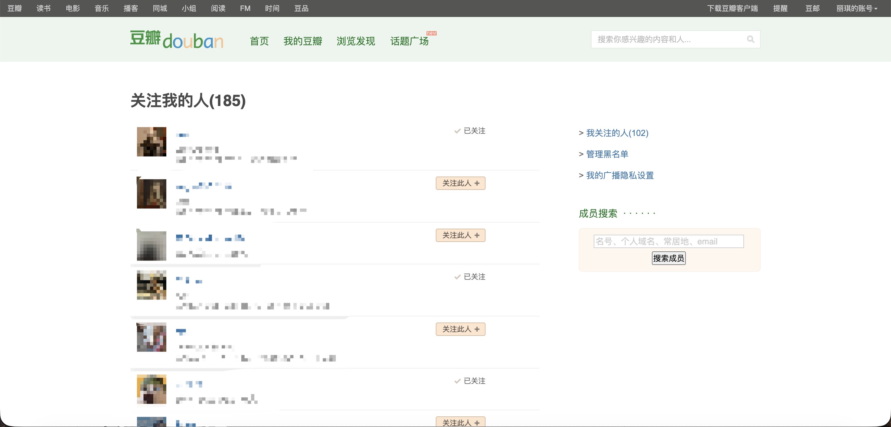
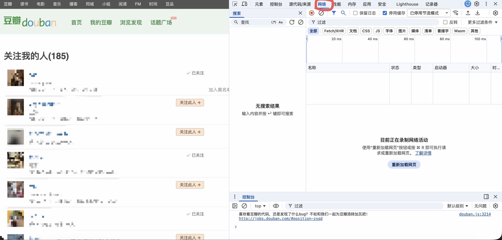
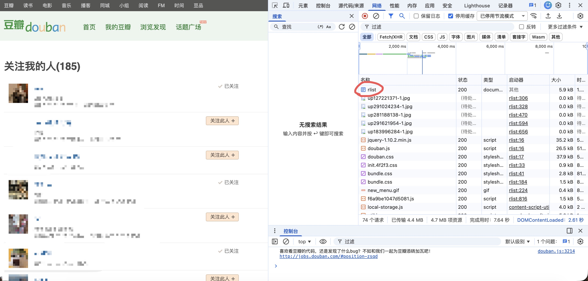
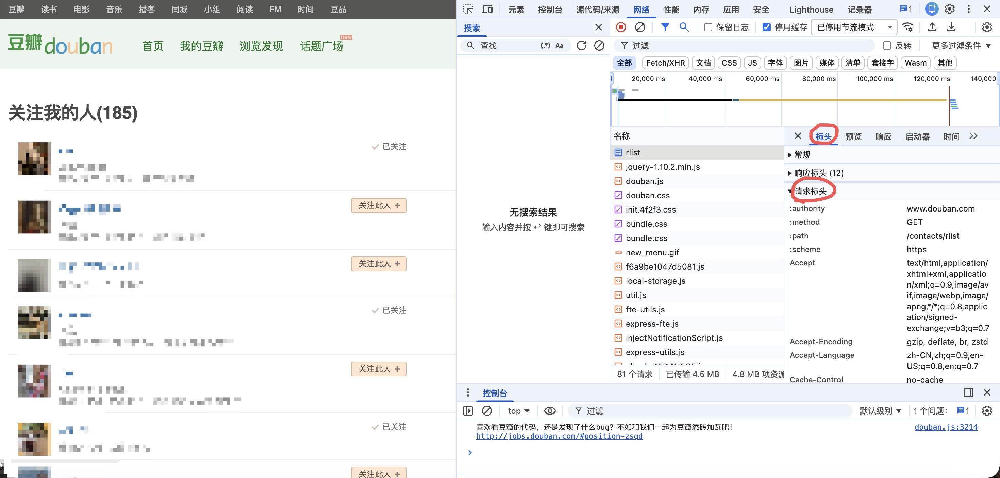
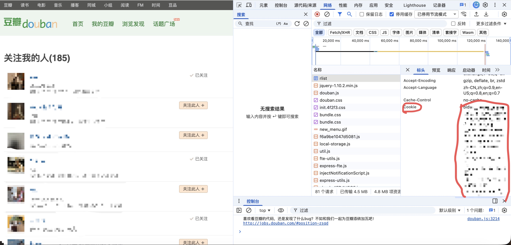

# 豆瓣取关检测器

这是一个在你自己电脑上运行的小工具，用来记录关注你的人数，并在下次检测时告诉你：哪些人在这段时间取关了你。

它不是实时提醒工具，你可以在发现豆瓣关注人数变少时，再打开它手动检测。

## 它怎么判断谁取关了你

第一次使用时，它会保存一份当前关注者名单，叫做“基线”。

之后再次检测时，它会比较：

```text
上次保存的名单 - 现在的名单 = 可能取关的人
```

如果有人新关注你，不会影响判断。  
如果某人取关后又重新关注你，因为最终还在名单里，就检测不出来。

## 第一次使用

### 1. 找到豆瓣 ID

豆瓣 ID 是你个人主页地址里的这一段：

```text
https://www.douban.com/people/豆瓣ID/
```

### 2. 复制 Cookie

详细步骤见下面的 [如何复制或更新 Cookie](#如何复制或更新-cookie)。

### 3. 打开小程序

Mac 电脑双击：

```text
豆瓣取关检测器.command
```

Windows 电脑双击：

```text
豆瓣取关检测器.bat
```

它会打开一个本地网页，这个页面只在你的电脑上运行。

这个工具需要 Python 3，启动文件会自动检测电脑里有没有 Python 3：

- Mac 如果没有 Python 3，会在终端里提示你选择：
  1. 使用 Homebrew 自动安装 Python 3
  2. 打开 Python 官方下载页面
  3. 退出
- Windows 如果没有 Python 3，会在命令行窗口里提示你选择：
  1. 使用 winget 自动安装 Python 3
  2. 打开 Python 官方下载页面
  3. 退出

如果选择手动下载安装，Windows 安装时请勾选 **Add python.exe to PATH**。安装完成后，重新双击对应的启动文件。

如果是第一次打开，页面会显示 **首次配置**：

1. 输入豆瓣 ID
2. 粘贴 Cookie
3. 点击 **保存配置**

保存后，程序会自动在本地生成 `config.json`。

第一次打开后：

1. 确认页面显示的“当前检测账号”是你的豆瓣 ID
2. 点击 **检测人数并设为基线**
3. 等进度条跑完
4. 如果人数正确，就可以关闭网页和终端窗口

如果账号不对，请关闭小程序，修改 `config.json` 里的 `"douban_user_id"` 后再重新打开。

## 如何复制或更新 Cookie

Cookie 是让这个工具以“你已经登录豆瓣”的状态读取关注者名单，不需要填写豆瓣密码。

在 Chrome 或 Edge 里：

1. 打开豆瓣，确认已经登录
2. 打开你的豆瓣“关注我的人”页面


3. 打开开发者工具：
   - Mac：按 `Option + Command + I`
   - Windows：按 `F12` 或 `Ctrl + Shift + I`


4. 点击顶部的 `网络`  
5. 刷新页面  
6. 在请求列表里点击第一行类似 `rlist` 或豆瓣页面主请求的项目


7. 右侧点击 `标头`


8. 找到 `请求标头` 里的 `Cookie`


9. 复制 `Cookie` 后面的整串内容，粘贴到网页小程序的输入框或 `config.json` 的 `"cookie"` 里

如果 Cookie 里出现这样的双引号：

```text
dbcl2="..."
```

在 `config.json` 里要写成：

```text
dbcl2=\"...\"
```

如果你是通过小程序的首次配置页面粘贴 Cookie，不需要手动处理这一步，直接粘贴浏览器里复制的内容即可。

## 之后怎么检测取关

过几天、几周或几个月后，如果你发现豆瓣显示“关注你的人”数量减少：

1. 再次双击对应系统的启动文件：Mac 用 `豆瓣取关检测器.command`，Windows 用 `豆瓣取关检测器.bat`
2. 确认页面显示的豆瓣 ID 正确
3. 点击 **检测是否有人取关**
4. 等检测完成
5. 页面会显示可能取关的人

如果没有发现取关，工具会自动把这次名单保存成新的基线。

如果发现有人取关，工具会先显示结果，但不会立刻覆盖基线。确认结果没问题后，点击 **确认并更新基线**，它才会把这次名单保存成新的基线。

## 查看检测历史

小程序页面下方有 **检测历史** 区域，会显示：

- 每次检测的时间
- 上次人数和本次人数
- 人数变化
- 发现的可能取关名单
- 这次名单是否已经更新为新基线

历史记录只保存在本地 `.state/history.json`，不包含 Cookie。

## 常见问题

### 提示登录、验证或禁止访问

通常是 Cookie 过期了，或者豆瓣触发了安全验证。

处理方法：

1. 在浏览器里重新登录豆瓣
2. 确认能正常打开“关注我的人”页面
3. 按 [如何复制或更新 Cookie](#如何复制或更新-cookie) 重新复制 Cookie
4. 在小程序里点击 **重新配置 Cookie**，粘贴后保存

### 检测很慢

这是正常的，工具需要一页一页读取关注者名单，并且中间会稍微等待，避免请求太频繁。

### 人数明显不对

先不要反复点击，等一会儿再试，或者重新复制 Cookie。

工具内置了保护：如果这次抓到的人数比上次少很多，它会拒绝保存，避免错误结果覆盖原来的基线。

### 关闭网页会不会影响以后检测

不会，基线名单保存在本地的 `.state/followers.json` 里，下次打开小程序还会继续使用。

## 隐私提醒

- `config.json` 里有你的登录 Cookie，不要上传或发给别人
- 这个工具不会保存你的豆瓣密码
- 检测结果和基线名单都只保存在你自己的电脑上

## 高级用法

如果你熟悉命令行，也可以这样运行： 
检测人数并设为基线：

```bash
python3 scripts/douban_unfollow_alert.py --config config.json --init
```

检测是否有人取关：

```bash
python3 scripts/douban_unfollow_alert.py --config config.json
```
